

# Rolisteam Convention Manager

It is dedicated to manager Table and Pen Role playing games in special Events (such as : convention, forum and feast).

# Tutorial [fr]
Nous allons voir comment ajouter des jeux (Games), un mj qui propose ces jeux en partie et ensuite nous verrons le mode spectateur avec le carousel. 

D'abord, ajoutons des jeux, pour cela cliquer sur le bonton `+` en bas à gauche de l'application.
Une nouvelle fenetre doit apparaitre. Remplissez la comme ça:
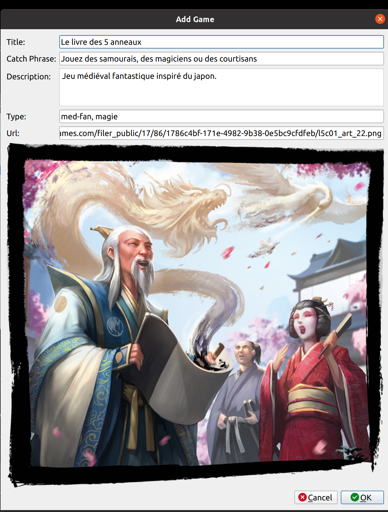
Pour l'aspect visuel, il est très important de fournir des images pour les jeux. 
Si vous avez les images sur votre ordinateur, il est possible de les copier/coller une url locale `file://c/dossier/vers/mon/images.jpg` 
Il convient d'ajouter autant de jeux que vous le souhaitez.
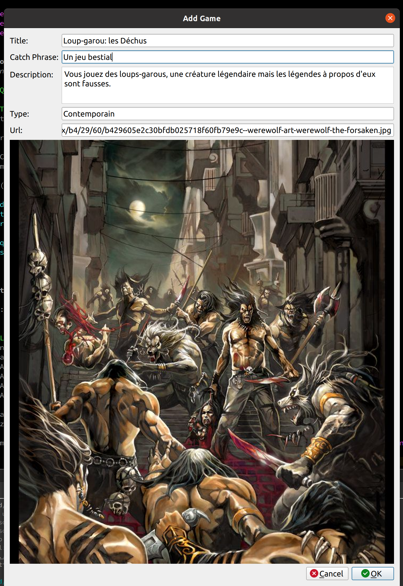

Une fois, vos jeux ajoutés, l'application doit ressemblés à ça. 
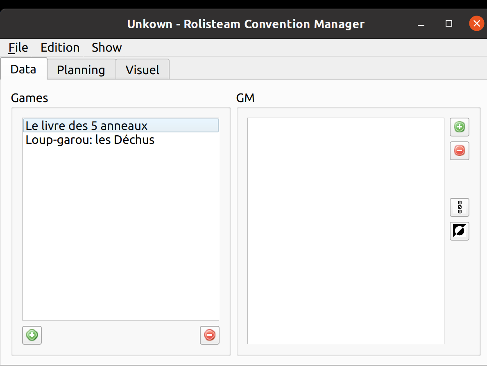

Nous allons maitenant ajouter un maitre de Jeu (MJ - GM en anglais)
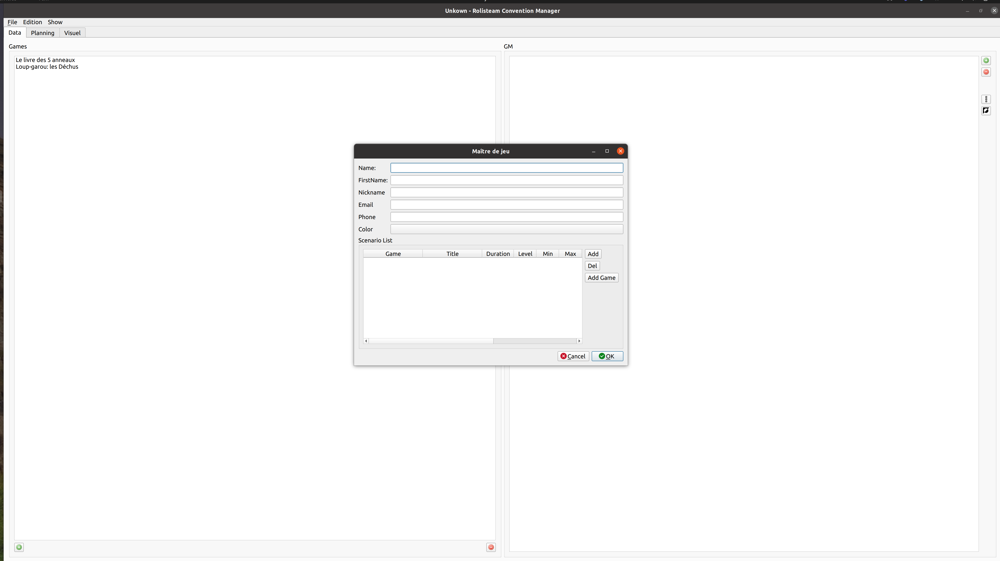

Vous devez remplir le formulaire pour chaque MJ. 
Si vous voulez vous limiter au strict minimum, vous pouvez saisir uniquement le pseudonyme (nickname), et choisir une couleur(color). Le reste c'est que du bonus. 
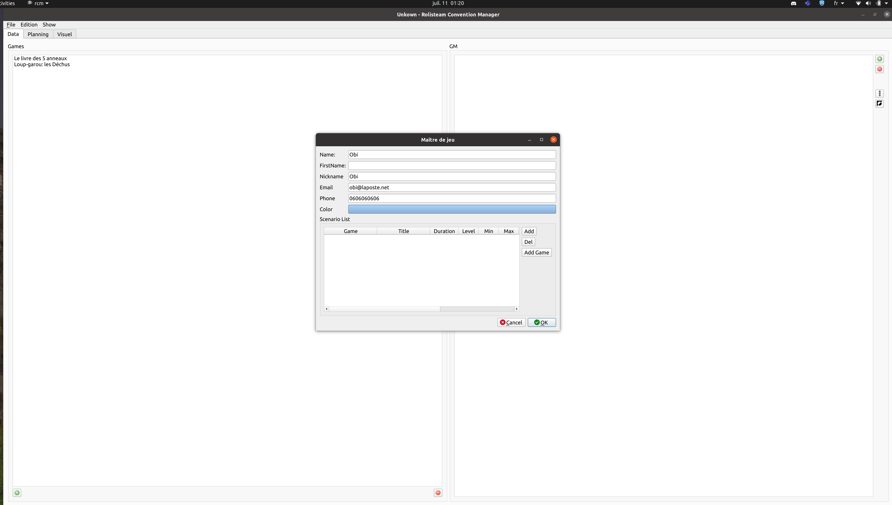

Une fois la partie données personnelles du MJ finie, il faut ajouter ses parties de jdr.
Clicker sur le bouton `Add` à droite du tableau vide autant de fois que le MJ a de parties.
Changez ensuite les données de chaque partie. Choississez le jeu, donner un titre à la partie/scénario, ajuster les nombres minimum et maximum de joueurs, vous pouvez également saisir une description de la partie et indiquer un niveau (pour débutant (beginner), moyen (middle) ou joueur expériementé (veteran))
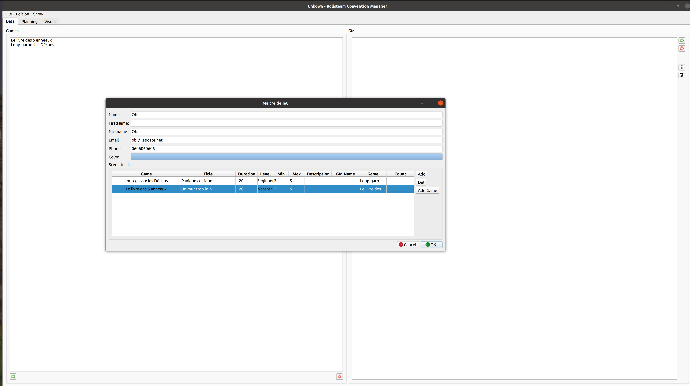

Quand vous avez fini, vos MJ apparaissent dans la liste des MJ. Vous pouvez les cocher/decocher pour signaler leur présence et disponibilité sur l'évenement. Un MJ coché est un mj qui peut faire jouer ses parties. Ses parties apparaissent dans la liste des parties disponibles (voir après).

Pensez à sauvegarder de temps en temps. Vous pouvez vous fier à la barre de titre de la fenetre principale pour connaitre le statut actuel et dans quel fichier votre convention est enregistrer (l'extension est: `rcd` pour `Rcm Convention Data`)
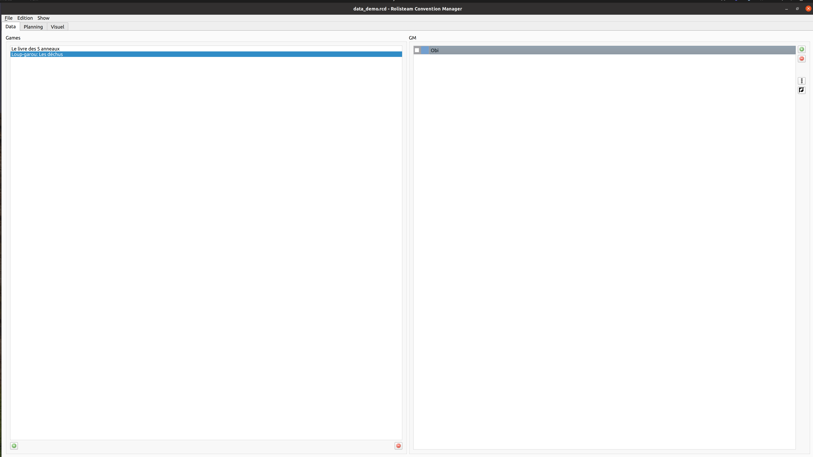

Pensez à cocher quelques MJ, puis affichier la liste `Menu > Show > Scenario List`.
Une fenetre doit s'ouvrir. Elle présente un carousel des parties disponibles. (Les illustrations ne montrent que 2 parties mais avec beaucoup plus c'est sympa). Vous pouvez tourner le carousel avec la souris.
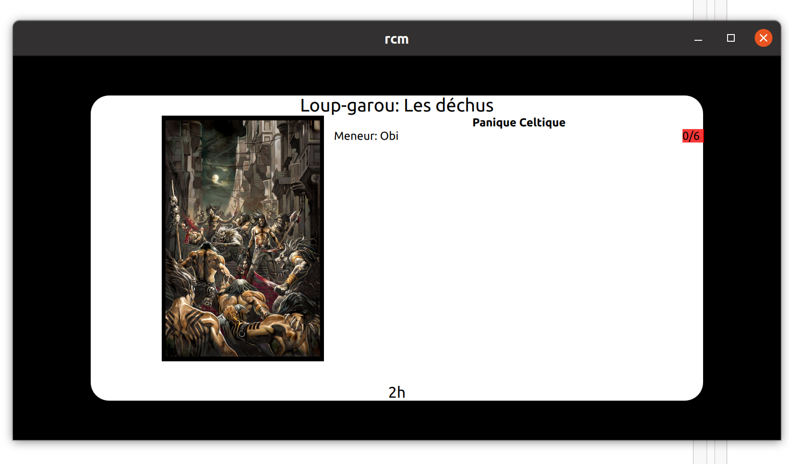

Pour aller sur une autre partie. 
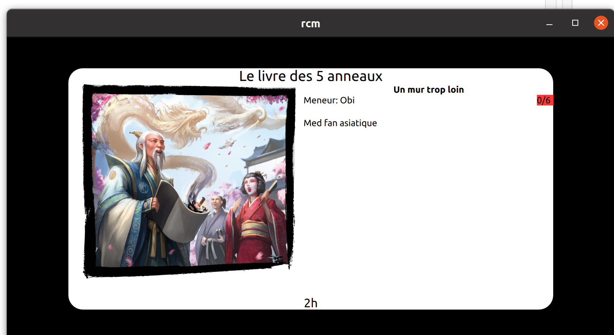

Un peu d'animation
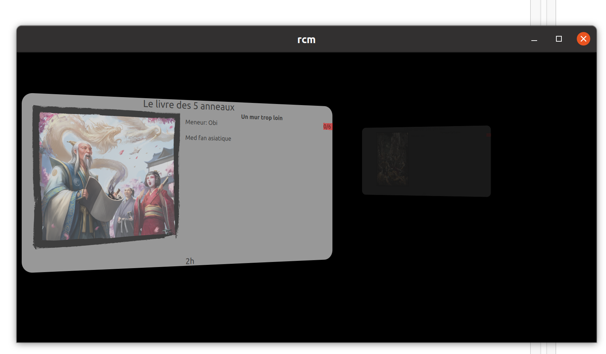

Encore un peu d'animation 
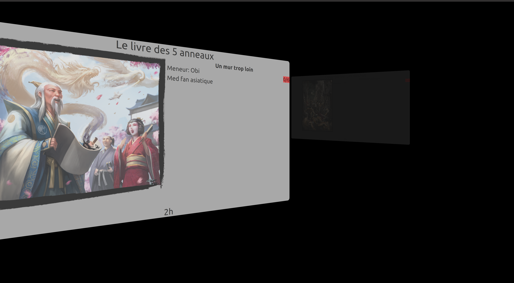

Vous pouvez mettre cette fenetre sur un autre écran, la mettre en plein écran et vous positionnez sur l'onglet Visuel pour controller l'aspect de votre fenetre de démo. Nous avons l'habitude de montrer cet écran au public de l'événement pour les inciter à jouer.

Depuis l'onglet de controle vous pouvez couper l'animation automatique ou la réactiver. 
Vous pouvez aussi afficher un message à l'écran. 

Et vous pouvez l'effacer en supprimant le texte.

# How to use

## Must be done before the convention

1. Add all games (please provide details and images: e.g: Ryuutama, DnD5, Vampire..)
2. Add all GMs (don't forget information to contact them), Add scenario to each GM
3. On the 3rd tab, click on wizzard button. Select the number of days of your event, set the beginning and ending hours for each day. Then, defines the number of table, set label to table when necessary). 
4. Save the convention into rcdb file.

## during the event

1. Load the rcdb file
2. On the fist tab, check all present GM (uncheck them when they lunch or leave). The check means the GM is ready or in game. Uncheck means GM is unavailable.
3. Show the scenario list. 
4. Move it to a screen where visitors can see it.
5. Start animation
6. Add information message

## Start a game

1. people arrive and they want to play
2. Registrer them into RCM and drag and drop the game on table timeline in the third tab. 

# TODO:

* Grid of Games
* Planing Tutorial
* Style Improvement
* Code refactoring